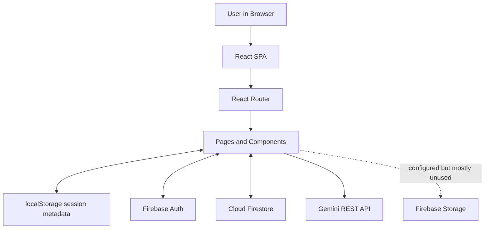
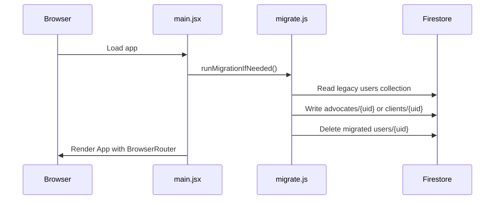
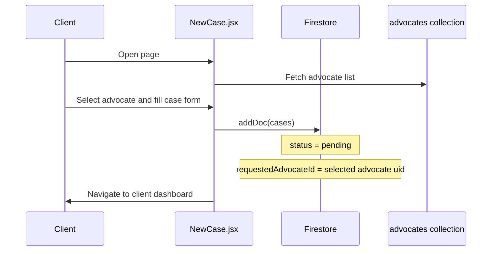

# Nyayadheesh Project Architecture Report

Generated on: 2026-04-24

Scope:

- This report describes the current codebase inside `nyayadheesh-platform/`.
- It is based on the live source files, not the older narrative `Report.md`.
- It reflects the current Firestore user schema fix: `advocates/{uid}` and `clients/{uid}`.

## 1. Project Summary

Nyayadheesh is a React single-page application for digital legal case management. It supports two user roles:

- Clients: create legal cases, track case progress, view hearings, upload documents, and chat with an advocate.
- Advocates: accept or reject case requests, manage accepted cases, schedule hearings, update timeline status, and chat with clients.

The app uses Firebase as its backend platform:
aa

- Firebase Auth for sign-in and registration.
- Cloud Firestore for application data.
- Firebase Storage is initialized but is not used by the current upload flow.

The frontend is a Vite + React + React Router app styled with Tailwind CSS v4.

There is also a browser-side AI helper page that sends prompts directly to the Google Gemini REST API using `axios`.

## 2. Workspace Structure

Important note:

- The active application lives in `nyayadheesh-platform/`.
- The workspace root also has a separate `package.json`, but the app runtime and build flow are driven by `nyayadheesh-platform/package.json`.

Top-level app folders:

| Path             | Purpose                                                     |
| ---------------- | ----------------------------------------------------------- |
| `src/`           | Main application source                                     |
| `public/`        | Static assets served by Vite                                |
| `dist/`          | Production build output                                     |
| `package.json`   | App dependencies and scripts                                |
| `vite.config.js` | Vite + React + Tailwind plugin configuration                |
| `README.md`      | Project readme                                              |
| `Report.md`      | Older narrative report, not fully aligned with current code |

## 3. Tech Stack and Tools

### Runtime stack

| Tool               | Current usage in project                                                        |
| ------------------ | ------------------------------------------------------------------------------- |
| React 19           | UI rendering with functional components and hooks                               |
| React Router DOM 7 | Route-based navigation                                                          |
| Firebase Auth      | Email/password login, Google popup login, auth session resolution               |
| Cloud Firestore    | Cases, hearings, documents, messages, client profiles, advocate profiles        |
| Firebase Storage   | Initialized in `firebase.js`, not actively used by current document upload path |
| Axios              | HTTP requests to Gemini API                                                     |
| React Calendar     | Calendar views for schedule screens                                             |
| Tailwind CSS v4    | Utility-first styling and theme tokens                                          |
| Vite 8             | Dev server and production builds                                                |

### Package layout

Core app dependencies from `nyayadheesh-platform/package.json`:

- `react`
- `react-dom`
- `react-router-dom`
- `firebase`
- `axios`
- `react-calendar`
- `react-slick`
- `slick-carousel`

Observations:

- `react-slick` and `slick-carousel` are installed, but the current schedule UIs use custom state-driven slide controls rather than a Slick carousel.
- Firebase Storage is configured, but uploads currently go into Firestore as Base64 blobs.

## 4. High-Level Architecture

### Layered view

| Layer                     | Responsibility                                                         |
| ------------------------- | ---------------------------------------------------------------------- |
| Presentation layer        | JSX pages, route screens, buttons, forms, cards, tables, calendars     |
| Client-side control layer | `useState`, `useEffect`, route navigation, localStorage session fields |
| Auth layer                | Firebase Auth state and sign-in flows                                  |
| Data access layer         | Firestore reads, writes, listeners, document references                |
| Integration layer         | Gemini REST calls via `axios`                                          |
| Utility layer             | migration helper and user-role path helper                             |

## 5. Current Firestore Data Model

The current live schema for users is:

- `advocates/{uid}`
- `clients/{uid}`

Application collections used by the app:

| Collection  | Key fields                                                                                                                                                                                             | Used by                                                        |
| ----------- | ------------------------------------------------------------------------------------------------------------------------------------------------------------------------------------------------------ | -------------------------------------------------------------- |
| `advocates` | `uid`, `name`, `barId`, `state`, `education`, `practiceCourtType`, `yearsActive`, `mobile`, `govtId`, `address`, `email`, `role`, `createdAt`                                                          | advocate login, client advocate selection, profile, dashboards |
| `clients`   | `uid`, `firstName`, `lastName`, `name`, `contact`, `govtId`, `email`, `city`, `role`, `createdAt`                                                                                                      | client login, advocate case view, profile                      |
| `cases`     | `clientId`, `requestedAdvocateId`, `advocateId`, `status`, `caseType`, `jurisdiction`, `court`, `matterType`, `description`, petitioner and respondent fields, `legalAct`, `legalSection`, `createdAt` | new case flow, both dashboards, case view, schedule            |
| `hearings`  | `caseId`, `clientId`, `advocateId`, `date`, `note`, `status`, `timelineStatus`, `createdAt`                                                                                                            | case view, schedule page, client dashboard, advocate dashboard |
| `messages`  | `text`, `sender`, `recipientId`, `type`, `timestamp`                                                                                                                                                   | chat page, dashboards, case acceptance/rejection notifications |
| `documents` | `fileName`, `fileType`, `fileSize`, `fileData`, `uploadedBy`, `caseId`, `uploadedAt`                                                                                                                   | upload page, client dashboard, case view                       |

Legacy collection:

- `users/{uid}` may still exist in older projects or datasets and is only used as a migration source by `migrate.js` and `pages/MigrateDB.jsx`.

## 6. Bootstrap and Application Entry Flow

### `src/main.jsx`

Responsibilities:

- Imports global CSS.
- Starts migration helper before rendering.
- Mounts the React app inside `BrowserRouter`.

Flow:

1. Import `runMigrationIfNeeded()` from `src/migrate.js`.
2. Execute migration once at startup.
3. Render `<App />` within `<BrowserRouter>`.

Why this matters:

- The app attempts to silently upgrade older `users/{uid}` records into the new role-based collections every time the app boots.

### `src/App.jsx`

Responsibilities:

- Declares the route table.
- Splits public screens from protected screens.

Public routes:

- `/`
- `/client-login`
- `/advocate-login`
- `/register`
- `/advocate-register`
- `/migrate`
- `/seed`

Protected routes:

- `/client-dashboard`
- `/advocate-dashboard`
- `/new-case`
- `/hearing`
- `/case-view`
- `/chat`
- `/ai-chat`
- `/upload`
- `/profile`
- `/schedule`

### `src/components/ProtectedRoute.jsx`

Responsibilities:

- Watches Firebase auth state using `onAuthStateChanged`.
- Blocks protected routes until auth state is known.
- Redirects unauthenticated users to `/`.

Important behavior:

- It stores `mock_uid` in localStorage when Firebase Auth resolves a user.
- It removes `mock_uid` when auth resolves to no user.

Architectural note:

- The app still uses `mock_*` localStorage naming even though it is backed by real Firebase authentication.

## 7. Shared Utility Modules

### `src/firebase.js`

Responsibilities:

- Initializes the Firebase app.
- Exports:
  - `auth`
  - `googleProvider`
  - `db`
  - `storage`

Architectural note:

- Firebase config is stored directly in frontend source, which is normal for Firebase web apps.
- Security must therefore come from Firebase Auth and Firestore rules, not from hiding config values.

### `src/lib/userStore.js`

Responsibilities:

- Centralizes the mapping between role names and Firestore collection names.

Exports:

- `getUserCollectionName(role)`
- `userDocRef(db, role, uid)`
- `userCollectionRef(db, role)`

Why it matters:

- This prevents pages from hardcoding user paths in many places.
- It is the shared fix that moved the app away from the invalid `users/advocates/{uid}` pattern.

### `src/migrate.js`

Responsibilities:

- Runs once on startup.
- Reads legacy `users/{uid}` docs.
- Moves them into:
  - `clients/{uid}`
  - `advocates/{uid}`
- Deletes migrated legacy docs.

Architectural role:

- A compatibility bridge for old databases.

## 8. Routing and Screen Responsibilities

| Route                 | Component               | Responsibility                                                  |
| --------------------- | ----------------------- | --------------------------------------------------------------- |
| `/`                   | `Landing.jsx`           | Entry screen with role selection                                |
| `/client-login`       | `ClientLogin.jsx`       | Client sign-in and client Google onboarding                     |
| `/advocate-login`     | `AdvocateLogin.jsx`     | Advocate sign-in and Google onboarding with profile completion  |
| `/register`           | `Register.jsx`          | Client registration                                             |
| `/advocate-register`  | `AdvocateRegister.jsx`  | Advocate registration                                           |
| `/client-dashboard`   | `ClientDashboard.jsx`   | Client home, cases, hearings, documents, news menu              |
| `/advocate-dashboard` | `AdvocateDashboard.jsx` | Advocate home, pending requests, accepted cases, hearing slider |
| `/new-case`           | `NewCase.jsx`           | Two-step case creation flow                                     |
| `/case-view`          | `CaseView.jsx`          | Advocate detail view for one case                               |
| `/hearing`            | `Hearing.jsx`           | Legacy simplified hearing creation screen                       |
| `/schedule`           | `Schedule.jsx`          | Shared calendar/schedule page for both roles                    |
| `/chat`               | `Chat.jsx`              | Real-time messaging UI                                          |
| `/upload`             | `UploadDocs.jsx`        | Upload documents for the active case                            |
| `/profile`            | `Profile.jsx`           | Shared profile editor and password change screen                |
| `/ai-chat`            | `AiChat.jsx`            | Browser-side Gemini legal assistant                             |
| `/migrate`            | `MigrateDB.jsx`         | Manual migration UI with logs                                   |
| `/seed`               | `SeedDB.jsx`            | Demo data seeding UI                                            |

## 9. Page-by-Page Code Walkthrough

### `Landing.jsx`

Purpose:

- Marketing-style entry page.
- Sends users to client or advocate login.

Navigation actions:

- Client card -> `/client-login`
- Advocate card -> `/advocate-login`

### `Register.jsx`

Purpose:

- Client registration using Firebase Auth email/password.

Writes:

- Creates Firebase Auth user.
- Creates `clients/{uid}` Firestore document.

Stored fields:

- `firstName`
- `lastName`
- `name`
- `contact`
- `govtId`
- `email`
- `city`
- `role`
- `createdAt`

### `AdvocateRegister.jsx`

Purpose:

- Advocate registration using Firebase Auth email/password.

Writes:

- Creates Firebase Auth user.
- Creates `advocates/{uid}` Firestore document.

Stored fields:

- `barId`
- `state`
- `name`
- `dob`
- `age`
- `education`
- `practiceCourtType`
- `yearsActive`
- `mobile`
- `govtId`
- `address`
- `email`
- `role`
- `createdAt`

### `ClientLogin.jsx`

Purpose:

- Client email/password login.
- Client Google popup login.

Reads:

- `clients/{uid}`

Writes:

- For new Google client users, creates `clients/{uid}` automatically.
- Writes session metadata to localStorage:
  - `mock_uid`
  - `mock_role`
  - `mock_email`
  - `mock_name`

### `AdvocateLogin.jsx`

Purpose:

- Advocate email/password login.
- Advocate Google popup login with mandatory profile completion for first-time users.

Reads:

- `advocates/{uid}`

Writes:

- For first-time Google advocate users, writes `advocates/{uid}` after collecting BAR and profile fields.
- Writes session metadata to localStorage:
  - `mock_uid`
  - `mock_role`
  - `mock_email`
  - `mock_name`
  - `mock_barId`

### `ClientDashboard.jsx`

Purpose:

- Main client workspace.

Realtime listeners:

- `cases`
- `hearings`
- `messages`
- `documents` inside `DocumentsSection`

Main features:

- Lists the current client's cases.
- Shows case tabs:
  - details
  - advocate
  - timeline
  - documents
- Shows upcoming hearing banner and schedule view.
- Opens chat, profile, AI assistant, and legal resources.
- Saves `caseId` to localStorage before document upload.

### `AdvocateDashboard.jsx`

Purpose:

- Main advocate workspace.

Realtime listeners:

- `cases`
- `hearings`
- `messages`

Main features:

- Splits case list into:
  - pending requests
  - accepted cases
- Accepts or rejects pending cases.
- Sends system messages to clients after accept/reject.
- Opens detailed case view.
- Shows upcoming hearing slider.

Notable implementation detail:

- Contains a debug panel for pending case matching and a UID debug strip.

### `NewCase.jsx`

Purpose:

- Two-step client case creation flow.

Flow:

1. Fetch advocates from `advocates`.
2. Client selects one advocate.
3. Client fills a detailed case form.
4. App writes a new `cases` document with `status: "pending"`.

Key linkage fields:

- `clientId`
- `requestedAdvocateId`
- `advocateId: null`
- `status: "pending"`

### `CaseView.jsx`

Purpose:

- Detailed advocate-side case management screen.

Reads:

- `cases/{caseId}`
- matching `hearings`
- matching `documents`
- matching `clients/{uid}`

Writes:

- Adds new `hearings` records.
- Adds system notifications into `messages`.
- Updates `hearings/{id}.timelineStatus`.

Tabs:

- case details
- schedule hearing
- client information
- timeline/progress
- documents

### `Hearing.jsx`

Purpose:

- Legacy, simpler hearing scheduling page.

Writes:

- Adds a `hearings` document with:
  - `caseId`
  - `advocateId`
  - `date`
  - `note`
  - `status`

Architectural note:

- This route overlaps conceptually with the scheduling functionality inside `CaseView.jsx`.

### `Schedule.jsx`

Purpose:

- Shared schedule screen for both roles.

Behavior by role:

- Client view: calendar + hearings on selected date.
- Advocate view: slider-like hearing viewer.

Reads:

- `cases`
- `hearings`

Pattern:

- Builds a local `cases` map first.
- Then filters hearings by cases belonging to the current user.

### `Chat.jsx`

Purpose:

- Shared messaging UI once a client and advocate are linked through an accepted case.

Reads:

- all `cases`
- user collection of the partner role
- `messages` ordered by timestamp

Writes:

- new `messages` documents

Key behavior:

- Determines conversation eligibility by checking for an accepted case involving the current user.

### `UploadDocs.jsx`

Purpose:

- Uploads a document for the selected case.

Flow:

1. User selects a file.
2. File is read into Base64 in the browser.
3. App writes a document into Firestore `documents`.

Stored document fields:

- `fileName`
- `fileType`
- `fileSize`
- `fileData`
- `uploadedBy`
- `caseId`
- `uploadedAt`

Architectural note:

- This is a Firestore-backed upload path, not a Firebase Storage-backed upload path.

### `Profile.jsx`

Purpose:

- Shared profile management for both roles.

Reads:

- either `clients/{uid}` or `advocates/{uid}`

Writes:

- updates the current role document
- updates password through Firebase Auth after reauthentication

### `AiChat.jsx`

Purpose:

- Lightweight AI legal assistant page.

Flow:

1. User submits a legal question.
2. Frontend sends prompt directly to Gemini endpoint.
3. Response text is extracted from the API result and shown in the UI.

Architectural note:

- There is no backend proxy for AI requests.

### `SeedDB.jsx`

Purpose:

- Seeds demo data through the app UI.

Creates:

- one advocate
- two clients
- multiple cases
- hearings
- messages

Why it matters:

- Useful for demos and for quickly populating the system during testing.

### `MigrateDB.jsx`

Purpose:

- Manual migration page with detailed progress logs.

Use case:

- Helps move old `users/{uid}` docs into current role-based collections.

## 10. End-to-End Data Flows

### 10.1 Startup and migration flow

### 10.2 Client registration flow

1. Client opens `/register`.
2. Form validates required fields and password confirmation.
3. `createUserWithEmailAndPassword()` creates Firebase Auth account.
4. Firestore profile is written into `clients/{uid}`.
5. User is signed out and redirected to `/client-login`.

### 10.3 Advocate registration flow

1. Advocate opens `/advocate-register`.
2. BAR and profile fields are validated.
3. Firebase Auth account is created.
4. Firestore profile is written into `advocates/{uid}`.
5. User is signed out and redirected to `/advocate-login`.

### 10.4 Login and session flow

Common pattern:

- Firebase Auth handles identity.
- localStorage stores role and display metadata for UI convenience.

Session keys used:

- `mock_uid`
- `mock_role`
- `mock_email`
- `mock_name`
- `mock_barId`
- `caseId`

Protected route gating:

1. `ProtectedRoute` waits for `onAuthStateChanged`.
2. If auth user exists, route is allowed.
3. If not, redirect to `/`.

### 10.5 Client creates a new case

### 10.6 Advocate accepts or rejects a case

1. Advocate dashboard listens to `cases`.
2. Pending cases are filtered where:
   - `status === "pending"`
   - `requestedAdvocateId === currentUid`
3. On accept:
   - `cases/{caseId}` is updated with:
     - `status: "accepted"`
     - `advocateId: currentUid`
   - a system message is added into `messages`
4. On reject:
   - `cases/{caseId}` is updated with `status: "rejected"`
   - a rejection system message is added into `messages`

### 10.7 Hearing scheduling flow

Primary path:

- Advocate opens `/case-view`.
- Uses the schedule hearing tab.
- Adds a new `hearings` document.
- Adds a system message notifying the client.

Timeline update path:

- Advocate updates `timelineStatus` of a hearing:
  - `scheduled`
  - `success`
  - `postponed`
  - `won`
  - `lost`

Client consumption:

- Client dashboard and schedule page read hearings in real time.

### 10.8 Chat flow

1. Chat page checks accepted cases to determine if the current user is connected to a counterpart.
2. It resolves the partner profile from the opposite role collection.
3. It subscribes to `messages` ordered by timestamp.
4. It inserts new messages into `messages`.

Current implementation note:

- Messages are not scoped to a specific conversation or case thread at query level.
- The page currently reads the whole `messages` collection and renders it.

### 10.9 Document upload flow

1. User enters document upload page through a selected case.
2. `caseId` is taken from localStorage.
3. File is read as Base64 using `FileReader`.
4. A `documents` record is written to Firestore.
5. Case detail screens then render the document using `fileData` or `fileUrl`.

Important architecture reality:

- The UI says "saved to database", and that is exactly what it does.
- It does not currently upload to Firebase Storage, despite `storage` being initialized.

### 10.10 AI assistant flow

1. User opens `/ai-chat`.
2. User enters a legal question.
3. `axios.post()` sends prompt data directly to Gemini endpoint.
4. Candidate text is extracted and displayed.

No server middle layer exists.

### 10.11 Manual migration flow

1. User opens `/migrate`.
2. The page reads legacy `users` docs.
3. It writes them into `clients` or `advocates`.
4. It deletes old docs.
5. It logs every step in the UI.

### 10.12 Seed flow

1. User opens `/seed`.
2. The page creates or reuses Firebase Auth users.
3. It creates matching role documents.
4. It creates demo cases, hearings, and messages.

## 11. State Management Approach

This project does not use Redux, Zustand, or another global state library.

Instead it uses:

- `useState` for local screen state
- `useEffect` for lifecycle-driven reads and subscriptions
- Firestore `onSnapshot` for realtime data
- localStorage for lightweight cross-page session metadata

This is a simple and workable architecture for a college project because:

- The app is small enough that local component state is manageable.
- Firestore already serves as a realtime shared source of truth.
- Session metadata is easy to reuse across routes.

Tradeoff:

- There is some duplication in session logic and query patterns across pages.

## 12. Styling and UI Architecture

### Theme system

Defined in `src/index.css`:

- `--color-neonBlue`
- `--color-neonPurple`
- `--color-darkBg`
- `--color-glass`

Visual style:

- dark background
- neon accent borders
- glowing shadows
- rounded cards and dashboard panels

Shared styling patterns:

- role-colored dashboards
- menu drawers
- tabbed content areas
- glassmorphism panels
- calendar highlight tiles

## 13. Architectural Strengths

- Clean separation between client and advocate experiences.
- Realtime updates are used throughout the product instead of manual refresh workflows.
- Firebase Auth + Firestore keeps backend complexity low.
- Migration and seed utilities make demos and schema evolution easier.
- The new `userStore.js` helper reduces repeated collection-path mistakes.
- Case lifecycle is explicit through `status` and hearing timeline fields.

## 14. Architectural Risks and Gaps

These are important observations from the current codebase.

### 14.1 AI key exposed in browser code

`AiChat.jsx` contains a direct Gemini API key in frontend source.

Risk:

- Anyone with browser access can inspect and misuse the key.

Preferred architecture:

- Move AI calls behind a backend or serverless function.

### 14.2 Documents are stored in Firestore, not Storage

`UploadDocs.jsx` writes `fileData` Base64 into Firestore documents.

Risks:

- Firestore has document size limits.
- Base64 inflates file size.
- The current UI allows files up to 5 MB, which is much larger than a safe Firestore document payload.

Preferred architecture:

- Upload binaries to Firebase Storage.
- Save only metadata and download URLs in Firestore.

### 14.3 Chat is globally queried

`Chat.jsx` subscribes to the entire `messages` collection ordered by timestamp.

Risks:

- Cross-user message leakage in UI logic.
- Poor scalability as messages grow.
- Hard to isolate one conversation or case thread.

Preferred architecture:

- Add conversation IDs or case-scoped threads.
- Query only the active conversation.

### 14.4 Unread count is also globally derived

Both dashboards count any message not sent by the current user.

Risk:

- Unread counters can become inaccurate because they are not filtered to relevant conversations.

### 14.5 Mixed auth/session sources

The app uses:

- Firebase Auth as the real authentication system
- localStorage `mock_*` keys as UI session data

Risk:

- Naming and behavior may confuse future maintainers.

Preferred architecture:

- Rename to `session_*` or derive more from auth/profile state directly.

### 14.6 Duplicate hearing creation flows

There are two ways to create hearings:

- `CaseView.jsx`
- `Hearing.jsx`

Risk:

- Feature drift between the two screens.

Preferred architecture:

- Keep one authoritative hearing creation flow.

### 14.7 Legacy and debug code still visible

Examples:

- Debug strips in `AdvocateDashboard.jsx`
- Legacy `Hearing.jsx`
- Old narrative `Report.md` with outdated schema descriptions

Risk:

- Confusion during demos or future maintenance.

### 14.8 Root workspace dependency split

There is a workspace-level `package.json` in addition to the app-level `package.json`.

Risk:

- Tooling confusion if someone runs commands from the wrong directory.

## 15. Suggested Next Improvements

Priority recommendations:

1. Move document uploads to Firebase Storage and keep only metadata in Firestore.
2. Introduce conversation/thread IDs for chat and unread counters.
3. Move AI calls behind a secure backend endpoint or cloud function.
4. Remove or hide debug panels from advocate dashboard.
5. Consolidate hearing creation into a single screen.
6. Replace `mock_*` localStorage naming with clearer session naming.
7. Add Firestore security rules documentation to the repo.
8. Add typed models or validation helpers for Firestore payloads.
9. Add an app-level data service layer for cases, hearings, messages, and users.
10. Update or archive the older `Report.md` so documentation matches code.

## 16. Build and Verification Status

Verified during this review:

- The app builds successfully with `npm run build` from `nyayadheesh-platform/`.
- The recent Firestore path fix compiles cleanly.

Current build note:

- Vite warns that the generated JS chunk is larger than 500 kB.
- This is a performance warning, not a build failure.

## 17. Quick File Index

| File                                | Responsibility summary               |
| ----------------------------------- | ------------------------------------ |
| `src/main.jsx`                      | Bootstraps app and startup migration |
| `src/App.jsx`                       | Route table                          |
| `src/firebase.js`                   | Firebase initialization              |
| `src/migrate.js`                    | Silent startup migration             |
| `src/lib/userStore.js`              | User role to collection mapping      |
| `src/components/ProtectedRoute.jsx` | Auth gate                            |
| `src/pages/Landing.jsx`             | Public entry screen                  |
| `src/pages/Register.jsx`            | Client registration                  |
| `src/pages/AdvocateRegister.jsx`    | Advocate registration                |
| `src/pages/ClientLogin.jsx`         | Client login                         |
| `src/pages/AdvocateLogin.jsx`       | Advocate login                       |
| `src/pages/ClientDashboard.jsx`     | Client dashboard                     |
| `src/pages/AdvocateDashboard.jsx`   | Advocate dashboard                   |
| `src/pages/NewCase.jsx`             | New case request creation            |
| `src/pages/CaseView.jsx`            | Advocate case management             |
| `src/pages/Hearing.jsx`             | Legacy hearing creator               |
| `src/pages/Schedule.jsx`            | Shared schedule UI                   |
| `src/pages/Chat.jsx`                | Messaging                            |
| `src/pages/UploadDocs.jsx`          | Firestore-based document upload      |
| `src/pages/Profile.jsx`             | Profile and password management      |
| `src/pages/AiChat.jsx`              | Gemini assistant                     |
| `src/pages/MigrateDB.jsx`           | Manual migration screen              |
| `src/pages/SeedDB.jsx`              | Demo data seeding                    |

## 18. Final Architecture Snapshot

In one sentence:

Nyayadheesh is a role-based React + Firebase legal workflow app where routing, local component state, localStorage session metadata, and Firestore realtime listeners work together to support case intake, advocate assignment, hearing management, document attachment, and client-advocate communication, with a browser-side AI helper layered on top.
